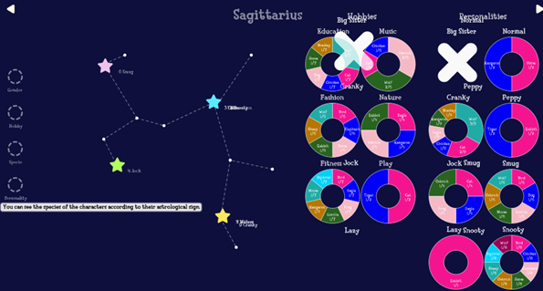

# Visualisation des caractéristiques des personnages non jouables du jeu “Animal Crossing : New Horizon” en fonction de leur signe astrologique

## Description
Cette visualisation de données a pour but de permettre la mise en lien des caractéristiques et du signe astrologique des personnages non jouables du jeu "Animal Crossing : New Horizon" de la compagnie Nintendo. La base de données utilisées pour ce projet a été trouvé sur le site [Kaggle](https://www.kaggle.com).

## Réflexion initiale
Nous avions pour objectif de créer une visualisation de données attrayante et différente, qui se distingue des tableaux dynamiques auxquels nous sommes habitués depuis notre scolarité. Étant toutes deux passionnées par les jeux vidéo, notamment Animal Crossing, il nous est apparu naturel de choisir cette thématique. Notre décision de mettre en avant les variables en fonction des signes astrologiques des personnages visait à fournir une base pour analyser les tendances et les régularités parmi leurs caractéristiques. Nous souhaitions ainsi déterminer si ces attributions étaient aléatoires ou s'il existait des tendances statistiques. En arrière-plan, cette approche nous permettait également d'interroger l'effet Barnum induit par l'astrologie. 

## Base de données des villageois
[base de données](https://www.kaggle.com/datasets/jessicali9530/animal-crossing-new-horizons-nookplaza-dataset?select=villagers.csv)
La base de données que nous avons utilisées a été mise en ligne par l'utilisatrice : Jessica Li. Ces données mettent en lien les variable que nous souhaitions interroger, mais ne contenais pas leur signe astologique. 

## Outils utilisés
Pour ce travail de visualisation de données, nous avons utilisé la bibliothèque D3 permettant les visualisation que nous avons utilisée : diagramme en bar et diagramme circulaire. Il nous a aussi permis d'expérimenter une représentation graphique en forme de nuage.

## Données
Les données contenu dans la base de donnée contiennent les informations suivantes : `Name`, `Species`, `Gender`, `Personality`, `Hobby`, `Birthday` , `Catchphrase`, `Favorite Song`,`Style1`, `Style2`, `Color1`.
Nous avons par la suite modifié les données de leur date de naissance pour y faire correspondre à la place leur signe astrologique. Nous avons donc rajouté à nos données la variable : `Sign`. 
Notre visualisation de données ne met pas en lien toutes les variables de la base de donnée car toute n'était pas sigificative dans notre modèle et ne nous permettant pas de répondre à nos interrogations. Nous avons donc choisit de prendre en compte les catégories : `Name`, `Species`, `Gender`, `Personality`, `Hobby` et `Sign`.

`Name` est unique au 391 personnages non jouable du jeu

`Gender` est une variable séparant les personnages entre males et femelles.

`Species` est une catégorie regroupant les villageois par leur espèce:

  - Alligator
  - Anteater
  - Bear
  - Bird
  - Bull
  - Cat
  - Chicken
  - Cow
  - Cub
  - Deer
  - Dog
  - Duck
  - Eagle
  - Elephant
  - Frog
  - Goat
  - Gorilla
  - Hamster
  - Hippo
  - Horse
  - Kangaroo
  - Koala
  - Lion
  - Monkey
  - Mouse
  - Octopus
  - Ostrich
  - Penguin
  - Pig
  - Rabbit
  - Rhino
  - Sheep
  - Squirrel
  - Tiger
  - Wolf

`Species` sépare les villageois en 6 traits de personnalitées:
  - Lazy
  - Normal
  - peppy
  - Jock
  - Cranky
  - Snooty

`Hobby`sépare les villageois parmis 1 des 6 hobbys possible dans le jeu:
  - Education
  - Fashion
  - Fitness
  - Music
  - Nature
  - Play

## Interface
Notre but avec cette interface était à la fois de permettre une navigation entre les multiples variables que nous avons voulu mettre en lumière, mais aussi de nous inspirer du design du jeu de base.  Nous avons mis beaucoup d'efforts pour le rendre le plus agréable à l'œil et aussi mignon que l’œuvre originel. Le tout, en restant dans le thème des signes du zodiaque grâce aux constellations.

Le point d'intérêt principal de  chaque page  se trouve au centre et représente signe astrologique sélectionné composée grâce à du SVG. En haut de la page, à gauche à droite se trouve des flèches qui permettent de sélectionner le signe astrologique suivant et précédent selon leur date dans l'année. 

À gauche de la page se trouve des boutons correspondant aux différentes sous-catégories que nous voulons explorer.  En passant dessus avec le curseur, celle-ci indique grâce à des graphiques les différentes statistiques entre les variables sélectionnées et le signe choisi qui s'adapte de manière dynamique.

## Utilisation

## Problèmes et améliorations 

Les principaux problèmes de ce code sont en lien avec les boutons ronds, la responsivité, l'utilisation des fonctions et les explications des graphes.
Le problème lié aux boutons survient lorsque la souris passe au-dessus d'un bouton alors que l'animation d'un bouton précédent n'est pas terminée. Puisque les éléments s'animent grâce à leur ID, si deux animations sont demandées en même temps, cela crée des conflits qui induisent des problèmes visuels nécessitant de rafraîchir la page.
Une solution pour régler ce problème serait d'établir des conditions avant de lancer les fonctions des boutons qui vérifieraient que les animations sont finies avant de lancer les suivantes. Une autre solution serait de repenser les interactions sur les boutons et de les remplacer par un clic pour éviter les conflits.
Sur cette image, nous pouvons observer le phénomène décrit ci-dessus 

 
Le code n’a malheureusement pas été conçu de manière responsive. Cela représente un problème esthétique pour les grands écrans ; toutefois, pour les petits écrans, cela empêche la consultation du code. Pour résoudre ce problème sur les petits écrans, une version adaptative pour les écrans plus petits que 1440x900 a été créée. Bien que tous les éléments s’affichent de manière adaptative pour ces écrans, esthétiquement ce n'est pas une réussite étant donné la quantité d'informations affichée.

« C’est en forgeant que l’on devient forgeron », cet adage s'applique aussi au codage. Nous avons beaucoup appris en réalisant ce code et l'une des leçons principales a été d'utiliser davantage de fonctions. Ce code n'est pas compliqué, mais il est très répétitif et long ; si nous avions utilisé des fonctions dès le début, nous nous serions épargné des casse-têtes et le code aurait été bien plus lisible. Dans les derniers fichiers JavaScript que nous avons écrits (par exemple, « BoutonPersonnalityOver »), on voit une meilleure utilisation des fonctions bien que cela soit encore insuffisant.

L’encadré explicatif des graphes pourrait être amélioré pour ajouter sa position en fonction des constellations et éviter des superpositions comme sur l’image ci-dessous.

 

En termes d’amélioration, le code bénéficierait de repenser le bouton « Specie », qui affiche quatorze diagrammes circulaires. Cette grande quantité d'informations semble contre-productive en termes d'attention. Les encadrés explicatifs mériteraient d’être plus complets pour mieux expliquer les différents diagrammes. Ajouter des étoiles scintillantes sur le fond uni bleu-noir ajouterait de la magie à la page qui est, dans l’état actuel, assez plate.

## Autrices
Le travail présenté à été fait par Delphine Mamie et Camille Steger-Pellerin, de la reflection préalable et la mise au point du concept, à la forme final. Cette visualisation de données à été créée dans le cadre du cours "visualisation de donnée" du professeur Isaac Pante de l'université de Lausanne au printemps 2022.

## Remerciment
Le professeur Isaac Pante pour son enseigement de qualité
